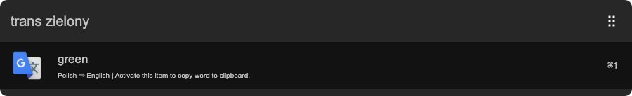
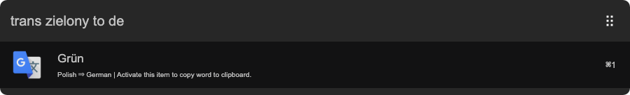
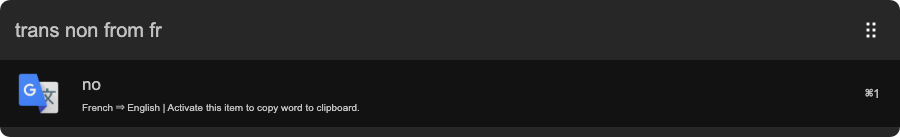
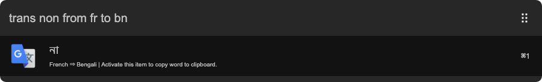

# arvis-polyglot

> Translate text using Google Translate in arvis

## 🔗 This workflow is converted from [alfred-workflow](https://github.com/nikersify/alfred-polyglot).

* Note that there might be some code change or different actions from the original workflow.

* Marked original workflow's creator to author.

## Install

```
$ npm install --global arvis-polyglot
```

*Requires [Node.js](https://nodejs.org) 7.6+*


## Setup

1. Set the default language text will get translated to if `to` parameter is not specified.

 ```
 trans !set default-language (language)
 ```

## Usage

```
trans (text) [from (language)] [to (language)]
```

The output will be translated `text`. Both `from` and `to` parameters are optional, and can be used anywhere in input.

## Examples













## License

MIT © [nikersify](https://nikerino.com)
